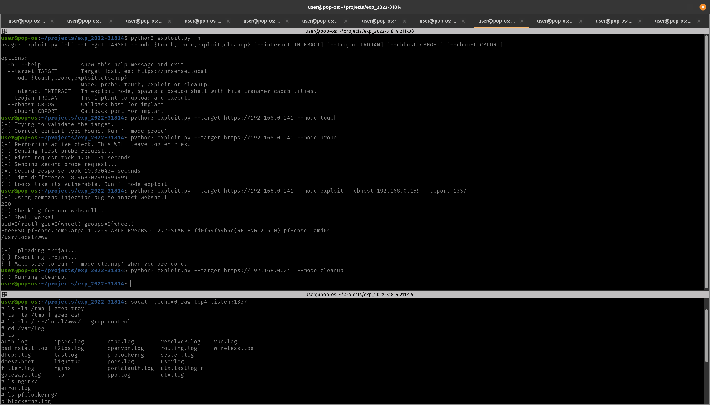

# SenselessViolence
CVE-2022-31814 (pfSense pfBlockerNG <= 2.1.4_26) Exploitation Toolkit.

## What?
This is an exploitation toolkit for the pfSense pfBlockerNG <= 2.1.4_26 plugins remote command injection feature discovered by IHTeam.

I wrote this to play around with some of the design principles found in the NSA's firewall exploitation toolkit - for this reason, its designed to be fully compatible with the nopen implant, have built-in log wiping features, and be extremely reliable by implementing some pre-flight checks (passive and active vulnerability tests). 

A trivial reverse TTY shell payload written in Python (these things ship with a Python interpreter) is supplied as a surrogate for nopen in this toolkit, because running sketchy binaries swiped from the NSA seems a tad foolish in production environments. 

## How to Use?
For yolo-scanning for beg bounties and mass-exploitation, run the nuclei template supplied (it should also have been upstreamed by now). This will give you a target list.

For precision carefulling of networks, there are four "modes" you will want to be aware of, and are documented below. Run them in order. These are set using the "--mode" flag.

- touch 
- probe
- exploit
- cleanup

### touch
This mode makes two HTTP requests - one to check its actually a pfSense (by checking the HTTP title on /), and one to the vulnerable endpoint to check it looks ok. This mode does not exploit anything. 

### probe
This mode makes two HTTP requests - both of which exploit the vulnerability. It injects a `sleep 1` and a `sleep 10` and makes sure the time difference between both requests is greater than 6 seconds. I added a bit of fuckit factor into this to account for latency if you are pitching the exploit over a proxy (you are, right?).

### exploit
This mode makes 3 HTTP requests. 

The first exploits the vulnerability to drop a webshell using a GET request.

The second uses the webshell to upload our trojan using a POST request.

The third uses the webshell to execute our trojan using a POST request.

### cleanup

This mode makes two HTTP requests.

The first uploads a cleanup script using the webshell.

The second executes the cleanup script.

The cleanup script zaps the logs, deletes the trojan, deletes the webshell, and then deletes itself. It does this in a reasonable manner. Not particularly forensically sound - I may fix that later. 

## Other arguments

- trojan - path to your trojan executable
- callbackhost - callback host for trojan
- callbackport - callback port for trojan
- target - target base url, eg: https://pfsense.local
- interact - spawns a shitty pseudo shell using the webshell in case you want to run commands, transfer files, etc via the webshell.
- help (prints a help menu)

## Screenshot of it in action.

## References
IHTeam Advisory: https://www.ihteam.net/advisory/pfblockerng-unauth-rce-vulnerability/
